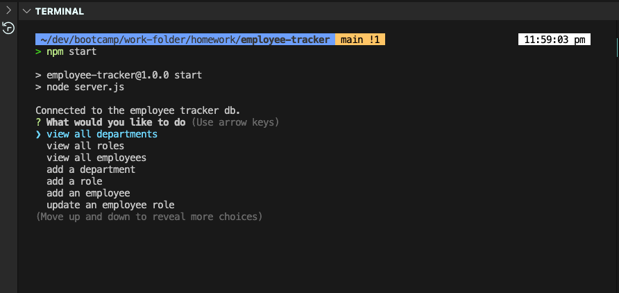

# Employee Tracker

## User Story
As a business owner I want to be able to view and manage the department, roles, and employees in my company, so that I can organize and plan my business.

## Description
* This is a command-line application, which allows user to view all departments, view all roles, view all employees, add a department, add a role, add an employee, and update an employee role. This app helps the user to keep track of their employee records.

## Table of Contents
- [Installation](#installation)
- [Usage](#usage)
- [How to Contribute](#how-to-contribute)
- [Questions](#questions)
- [License](#license)

## Installation
* In the root directory you want to run "npm i" to install all the required packages.

## Usage
* User can type "npm start" to start the user prompt in the root directory.

* User is prompt to press any key to continue after the results is displayed.

* User can quit by selecting the quit option in the main menu

* This project uses the npm inquirer, mysql2, console.table and dot.env package

## License
* This project is under the MIT license.
* If you want to get more details about the license, please visit [Choose License](https://choosealicense.com "Choose License")

## How to Contribute
* Feel free to contact via email or github or fork my repo and request for pull request!

## Tests
* Some inputs will have vaildation and throw errors if data type aren't meeting the requirements.

## Questions
* Please contact me via my [Github Username](https://github.com/johnxlai)

* You can reach me with additional questions <a href="mailto:lai.john.py@gmail.com">lai.john.py@gmail.com</a>

# Screenshot

## Repo
https://github.com/johnxlai/employee-tracker
## WalkThrough Video
https://drive.google.com/file/d/1zKDm3_RNRF0xhl7HIcSfiNnQ_BCQhymY/view
